<div align="center">

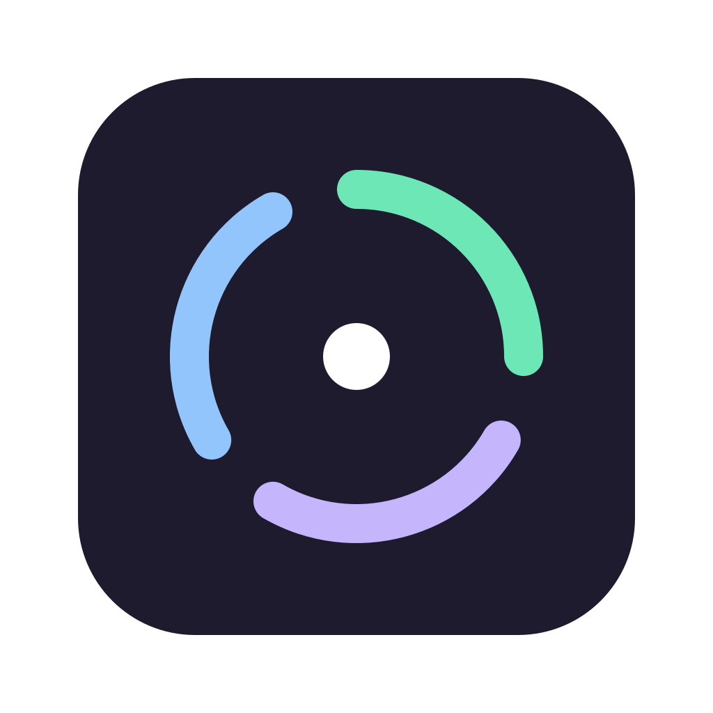

# RunJam

### One Desktop. All Your AI Agents. Zero Lock-in.

A local-first desktop manager for **Claude Code, Codex CLI, and Gemini CLI** — install once, run any model on any agent, and manage every project in a single window. No ACP rewrites, no per-agent config, no cloud lock-in.

[](https://github.com/peintune/runjam/stargazers)
[](https://github.com/peintune/runjam/releases/latest)
[](https://opensource.org/licenses/MIT)
[](https://tauri.app)
[](https://github.com/peintune/runjam/releases/latest)
[](https://github.com/peintune/runjam/releases/latest)
[](https://github.com/peintune/runjam)
[](CONTRIBUTING.md)
[](https://www.runjam.app/)

[Features](#-why-runjam) · [Quick Start](#-quick-start) · [Architecture](#-architecture) · [Roadmap](#-roadmap) · [FAQ](#-faq)

**Works with:** Claude Code · Codex CLI · Gemini CLI

[🌐 Visit Website](https://www.runjam.app/) · [中文文档](README.zh-CN.md)

<br/>

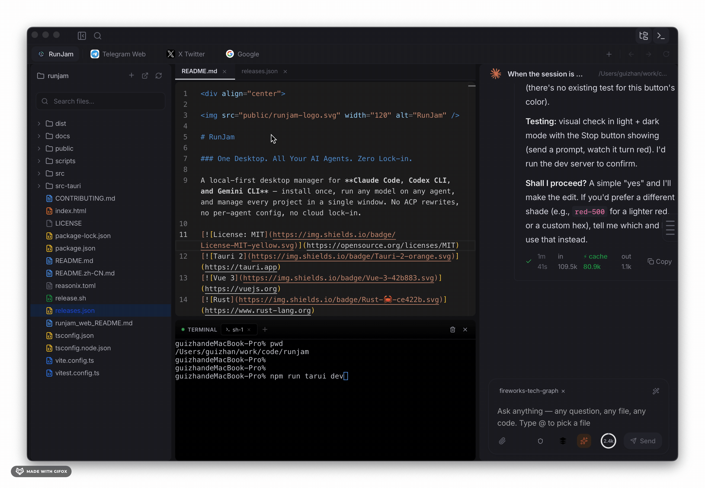
<br/>
<br/>

</div>

## 🏗️ Architecture

> Understand RunJam at a glance: **Agents → RunJam (auto protocol conversion) → Models (cloud + local)**.

<p align="center">
  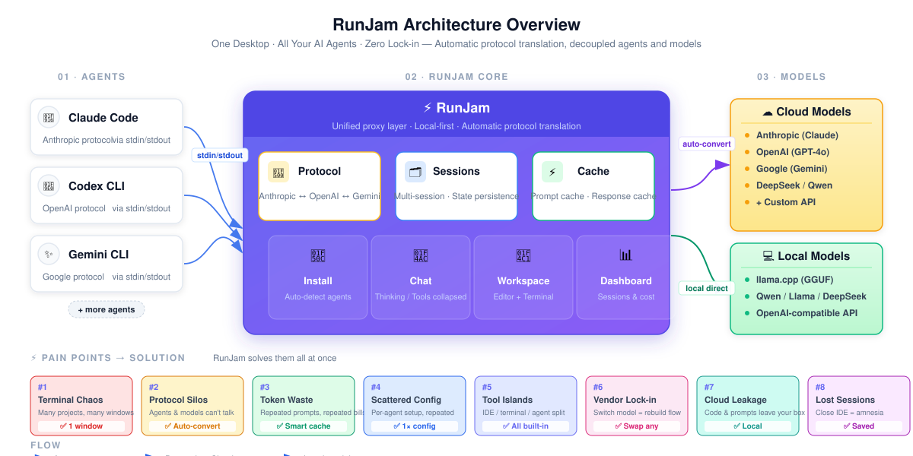
  <br/>
  <sub>🇨🇳 <a href="docs/screenshots/zh/00-architecture.svg">中文版</a></sub>
</p>

**Reading order (left → right):**

- **01 · AGENTS** — Any Agent CLI (Claude Code / Codex CLI / Gemini CLI / …) connects via `stdin/stdout` — **no agent modification required**
- **02 · RUNJAM CORE** — Three core capabilities: 🔀 **Protocol conversion** (Anthropic ↔ OpenAI ↔ Gemini), 🗂️ **Session management** (parallel sessions, persistent state), ⚡ **Cache optimization** (prompt cache + response cache); plus four capabilities below: 🔌 Install / 💬 Chat / 📁 Workspace / 📊 Dashboard
- **03 · MODELS** — Plug in any model: ☁️ Cloud (Anthropic, OpenAI, Google, DeepSeek, Qwen, custom API) and 💻 Local (llama.cpp + GGUF, OpenAI-compatible API)
- **Bottom · Pain Points → Solutions** — Terminal chaos, protocol silos, token waste, scattered config, tool islands, vendor lock-in, cloud leakage, lost sessions — each mapped to a built-in fix

---

## 30 seconds to get RunJam

- 🪟 **One window, every project.** Chat, file tree, Monaco editor, and terminal — all in one app, multiple sessions in parallel.
- 🔌 **Any agent, any model.** Built-in protocol proxy converts Anthropic ↔ OpenAI ↔ Gemini on the fly. Claude Code can use GPT. Codex can use Claude. Configure once, sync everywhere.
- 🛠️ **Zero agent modifications.** Unlike ACP-based tools, RunJam drives agents through their native CLI (stdin/stdout). Works today, with any agent.
- 💸 **Cut your API bill.** Automatic prompt-cache detection, local response cache, and one-click local models (llama.cpp).
- 🔒 **Local-first & private.** Conversations, configs, and API keys stay on your machine. Telemetry is off by default, no cloud sync.

---

## 😩 The Pain — Why RunJam Exists

If you use AI coding agents daily, you've felt at least one of these:

> **1. The terminal zoo.** Five terminal tabs, each running a different agent, each on a different project. You forget which is which, kill the wrong one, and lose a session.

> **2. The model mismatch.** You want to test a prompt on Claude Sonnet *and* GPT-4o *and* a local Qwen. Today that means three different configs in three different files in `~/.claude/`, `~/.codex/`, `~/.gemini/`.

> **3. The protocol wall.** Claude Code speaks Anthropic. Codex speaks OpenAI. Gemini CLI speaks Google. You can't easily mix-and-match — and adding a new model provider to one agent means digging into its internals.

> **4. The token bleed.** You're paying for the same system prompt to be re-sent on every turn. You don't know which sessions cost the most. You can't tell what's cached vs. fresh.

> **5. The setup grind.** New project, new agent, new API key, new config file, new PATH issue, new npm install, new version mismatch. Every. Single. Time.

> **6. The single-agent lock-in.** Cursor wraps GPT-4. Copilot wraps OpenAI. If the model changes or the price doubles, you migrate your whole workflow.

> **7. The cloud data worry.** Some "AI IDEs" send your code to vendor servers. Your proprietary code, your private configs, your prompts — out of your control.

> **8. The session black hole.** Close your IDE → lose your chat history. Switch machines → start over. Want to find that one prompt from last week? Good luck.

---

## ✅ What RunJam Does About It

| Pain | RunJam's answer |
|------|-----------------|
| Terminal zoo | **One unified window** with parallel sessions, sidebar, and per-session workspaces |
| Model mismatch | **Unified Model Hub** — set a model once, assign per-agent with two clicks |
| Protocol wall | **Built-in protocol proxy** that auto-translates between Anthropic, OpenAI, and Gemini on the fly |
| Token bleed | **Prompt-cache auto-detection** + local response cache + per-session cost dashboard |
| Setup grind | **Auto-detect + one-click install** for Claude Code, Codex CLI, Gemini CLI |
| Single-agent lock-in | **Agent-agnostic by design** — switch agents without changing your workflow |
| Cloud data worry | **Local-first.** All data in `~/.runjam/`, API keys in OS keychain, telemetry off by default |
| Session black hole | **Persistent sessions**, full-text search, archive, multi-device friendly |

---

## 🆚 How RunJam Compares

| | **RunJam** | Cursor / Copilot | AionUI | Multiple terminals (tmux) |
|---|:---:|:---:|:---:|:---:|
| Local-first, no cloud | ✅ | ❌ | ✅ | ✅ |
| Works with any AI agent CLI | ✅ | ❌ | ⚠️ ACP only | ✅ |
| Auto-converts model protocols | ✅ | ❌ | ⚠️ | ❌ |
| One-click agent install | ✅ | ❌ | ❌ | ❌ |
| Multi-project in parallel | ✅ | ❌ | ⚠️ | ✅ |
| Built-in editor + terminal + file tree | ✅ | ✅ | ⚠️ | ⚠️ |
| Local model (llama.cpp) | ✅ | ❌ | ❌ | ⚠️ |
| App manager (configure your own web apps) | ✅ | ❌ | ❌ | ❌ |
| Session dashboard / kanban | ✅ | ❌ | ❌ | ❌ |
| Cost tracking dashboard | ✅ | ❌ | ❌ | ❌ |
| Open source (MIT) | ✅ | ❌ | ✅ | ✅ |
| Agent needs no modification | ✅ | n/a | ❌ | n/a |

---

## ✨ Features in Detail

### 🛠️ Agent Management

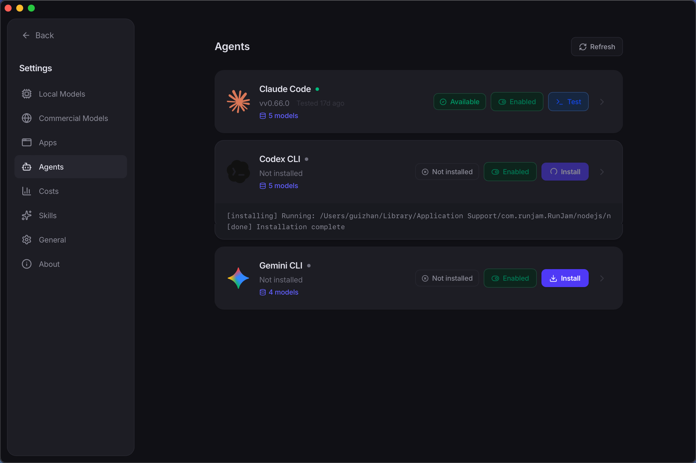

- **Auto-detection** — Scans your `PATH` for `claude`, `codex`, `gemini` and shows what's installed
- **One-click install / uninstall** — `npm install -g` with real-time progress
- **Agent config viewer** — Edit `~/.claude/`, `~/.codex/`, `~/.gemini/` from the GUI
- **Per-session enable / disable** — Use only the agents you want, per project

### 💬 Unified Chat Interface

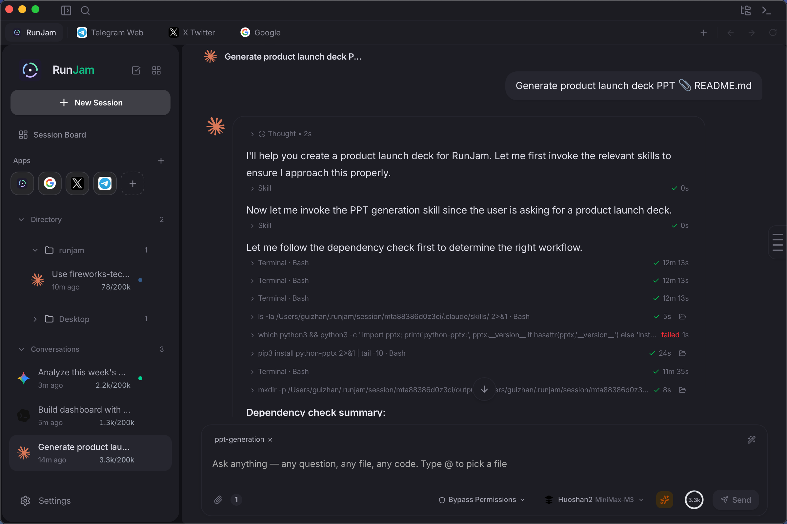

<br/>
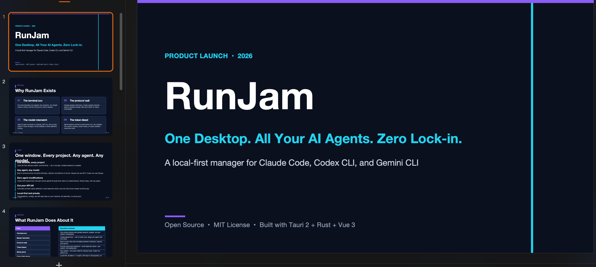

- **Real-time streaming** — Watch thinking steps, tool calls, and final answers live
- **Markdown + syntax highlighting + Mermaid diagrams** — Rendered cleanly inline
- **Collapsible thinking blocks** — Agent reasoning is separate from the final answer
- **Expandable tool call details** — Inspect inputs and outputs without leaving the chat
- **Multi-agent switching** — Switch between Claude Code / Codex / Gemini as easily as switching chat partners

### 📁 Project Workspace


- **VS Code-style file explorer** — Tree view of your project
- **Monaco-powered code editor** — The same engine VS Code uses, with full syntax highlighting
- **Integrated xterm.js terminal** — One terminal per project, persistent
- **Recent projects** — Quick access to the directories you actually use

### 🧠 Unified Model Hub

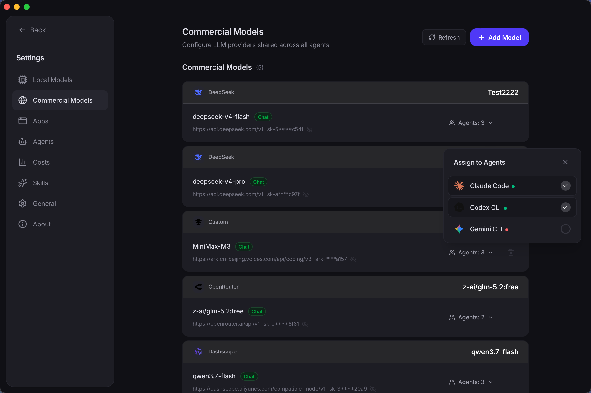

- **Configure once, sync everywhere** — One model config, applied to all agents
- **Provider presets** — Anthropic, OpenAI, Google AI, Groq, DeepSeek, Qwen, custom APIs
- **Per-agent model assignment** — Give Claude Code a different model than Codex
- **Model aliases** — Friendly names like `fast` and `smart` mapped to real model IDs
- **Local API proxy** — Built-in proxy unifies API key management and protocol conversion

### 💻 Local Model Launcher

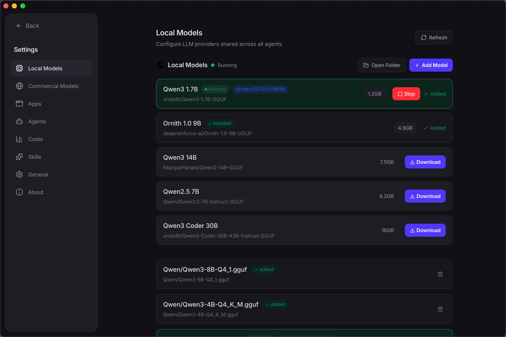

<br/>
<br/>


<br/>
<br/>


Run open-source LLMs on your own hardware. **Free. Offline. Private.**

- **Built-in llama.cpp server management** — Start, stop, and monitor local inference
- **Download GGUF models from the UI** — DeepSeek Coder, Qwen, Llama, Mistral, etc.
- **One-click start** — Pick a model, click Start, and RunJam wires it into the same proxy as cloud providers
- **Zero API cost** — No rate limits, no token bills, no data leaving your machine
- **OpenAI-compatible API** — Local models speak the same protocol, so every agent can use them out of the box

> **Why this matters:** Your proprietary code and prompts never touch a vendor server. You can run a 7B model on a laptop for routine tasks and route only the hard ones to a paid API — best of both worlds.

### 🧩 App Manager 

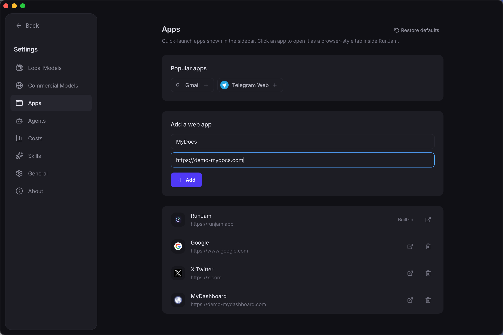

Pin your own web apps alongside RunJam. **One launcher, everything in reach.**

- **Register any web app** — Internal dashboards, docs sites, Grafana, Sentry, your company wiki
- **Custom name, URL, icon** — Make it look like a first-class part of RunJam
- **One-click open** — No more digging through browser bookmarks
- **Useful for AI context** — Pair an app (e.g. logs dashboard) with an agent session so the agent can read it via MCP or browser tools

### 📊 Session Dashboard

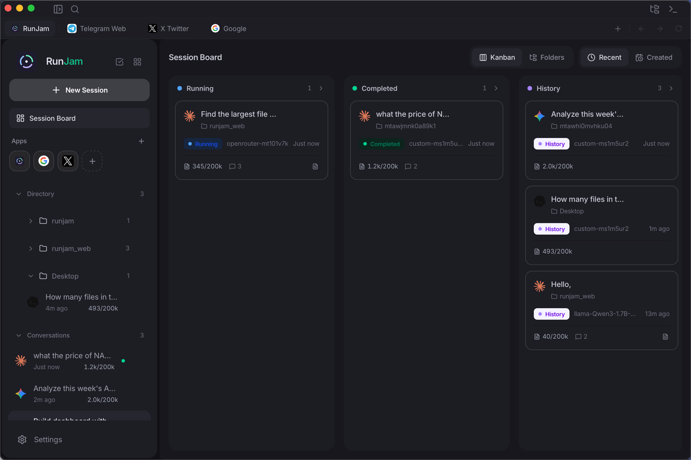

See every session at a glance. **No more "which agent is doing what" guesswork.**

- **Kanban / list view** — Sessions as cards across columns: Idle / Running / Waiting / Error
- **Per-session status** — Live indicator: is the agent working, waiting for input, or stalled?
- **Project + agent badges** — At-a-glance context for every card
- **Last activity timestamp** — Know which sessions need attention
- **Drag to reorganize** — Your workflow, your layout
- **Click to jump** — Open the session straight from the card

> **Why this matters:** When you're running five agents on five repos, "where is everything" is the hardest question. The dashboard makes it obvious.

### 💰 Cost Tracking

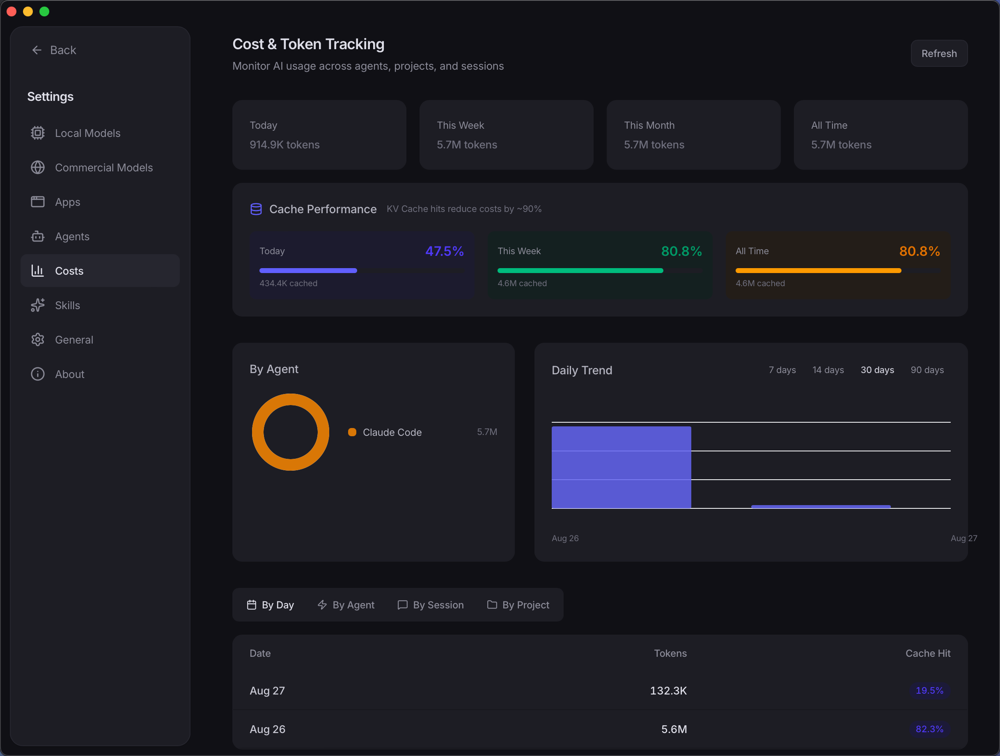

- **Token usage per session** — Know exactly where the budget goes
- **Cost estimation** — By model, by agent, by day
- **Chart dashboard** — Trends at a glance
- **Cache hit rate** — See how much the prompt cache is saving you

### 🔀 Protocol Proxy (the secret sauce)


Most managers just hand the agent's request to a vendor API. RunJam does more:

- **Anthropic ↔ OpenAI ↔ Gemini auto-translation** — Any agent can use any model
- **Response cache** — Repeat queries answered locally, no token cost
- **Prompt-cache detection** — Sees when an upstream API already cached your prompt, so you don't get billed twice
- **Single API key entry point** — Keys stored in OS keychain, proxied to agents transparently

> **This is what makes "configure once, sync everywhere" real.** Without the proxy, you'd need separate configs per agent per model. With it, one model definition drives all agents.

### 🔒 Local-First & Secure

- **All data local** — Conversations, configs, and agent states in `~/.runjam/`
- **Telemetry off by default** — an anonymous usage-data switch exists in Settings → General, defaulting to off
- **No cloud dependency** — Works fully offline (agents need their own API access)
- **System keychain** — API keys never touch plaintext config files
- **Local models** — Run models via llama.cpp with zero API cost

### 💼 Session Management

- **Multi-session parallel** — Run as many agent sessions as your machine can handle
- **Session persistence** — Sessions survive app restarts, even crashes
- **Full-text search** — Find any past prompt, response, or tool call
- **Archive** — Move old sessions out of the sidebar without losing them
- **Cost tracking** — Built-in, per session

---

## 🧩 Typical Day with RunJam

**Scenario 1 — Monday morning, three repos to touch**

Open RunJam. The session dashboard shows three cards: `runjam-core` (Claude Code, running), `api-refactor` (Codex, idle, needs your input), `experiments` (Gemini, waiting for review). You click the Codex one, drop a new prompt, and move on. All three projects in one window. No terminal switching.

**Scenario 2 — Mid-week, cost audit**

Open the Cost Tracking dashboard. The chart shows you spent 60% of this week's tokens on the `api-refactor` session, mostly on GPT-4o. You open the model hub, swap it to a local Qwen-Coder for routine refactors, and reserve GPT-4o for the hard ones. Next week, the same chart is half the size.

**Scenario 3 — Friday, sensitive task**

Client sends you a contract clause with their proprietary pricing model. You don't want any of it touching a vendor API. You open the Local Model Launcher, click Start on the Qwen-72B you already downloaded, and run the analysis entirely on your machine. Data never leaves your laptop.

---

## 🤖 Supported Agents

| Agent | CLI Command | Install | Provider |
|-------|------------|---------|----------|
| **Claude Code** | `claude` | `npm install -g @anthropic-ai/claude-code` | Anthropic |
| **Codex CLI** | `codex` | `npm install -g @openai/codex` | OpenAI |
| **Gemini CLI** | `gemini` | `npm install -g @google/gemini-cli` | Google |

> More agents on the way. RunJam's agent layer is pluggable — adding a new agent is detection + invocation, no protocol work needed.

---

## 🚀 Quick Start

### Prerequisites

- **Node.js** ≥ 18 (required by AI agent CLIs)
- **Rust** ≥ 1.80 (for building from source)
- **System dependencies**:
  - **macOS**: Xcode Command Line Tools
  - **Windows**: Microsoft Visual Studio C++ Build Tools + WebView2
  - **Linux**: `webkit2gtk` and related packages

### Option A — Download a Release (fastest, 5 minutes)

Grab the latest installer from **[GitHub Releases](https://github.com/peintune/runjam/releases/latest)**:

| Platform | Installer |
|---|---|
| macOS (Apple Silicon) | `RunJam-*-aarch64.dmg` |
| macOS (Intel) | `RunJam-*-x64.dmg` |
| Windows (x64) | `RunJam-*-x64-setup.exe` |
| Linux | Work in progress (see [Roadmap](#-roadmap)) |

Install, open RunJam, and it auto-detects the AI agents already on your `PATH`. Then follow the [First Run](#first-run) steps — most people are chatting with an agent in under 5 minutes.

### Option B — Build from Source

```bash
# Clone the repository
git clone https://github.com/peintune/runjam.git
cd runjam

# Install frontend dependencies
npm install

# Run in development mode (hot reload)
npm run tauri dev

# Build for current platform (macOS → .dmg, Windows → .msi/.exe, Linux → .deb/.AppImage)
npm run tauri build
```

Build artifacts will be in `src-tauri/target/release/bundle/`.

#### Platform-specific builds

```bash
# macOS: build universal binary (Intel + Apple Silicon)
npm run tauri build -- --target universal-apple-darwin

# macOS: build Intel-only .dmg
npm run tauri build -- --target x86_64-apple-darwin

# macOS: build Apple Silicon-only .dmg
npm run tauri build -- --target aarch64-apple-darwin

# Windows: build .msi / .exe (run on Windows, or cross-compile from macOS/Linux)
npm run tauri build -- --target x86_64-pc-windows-msvc

# Linux: build .deb / .AppImage
npm run tauri build -- --target x86_64-unknown-linux-gnu
```

> **Cross-compilation note:** Building Windows binaries from macOS/Linux requires additional Rust toolchains. It's recommended to build each platform's package on that platform directly (e.g., use CI runners).

### First Run

1. Open RunJam — it auto-detects installed AI agents
2. Go to **Settings → Agents** to install missing agents (one-click)
3. Go to **Settings → Models** to configure your API keys and models
4. *(Optional)* Go to **Local Models** to download and start a GGUF model
5. *(Optional)* Go to **App Manager** to pin your most-used web apps
6. Click **New Session**, pick an agent, optionally select a project folder
7. Start chatting!

---


### Tech Stack

| Layer | Technology | Why |
|-------|-----------|-----|
| **Desktop Framework** | Tauri 2 | 90% smaller than Electron, native performance |
| **Backend** | Rust | Zero GC pauses, excellent process management |
| **Frontend** | Vue 3 + TypeScript | Reactive, ecosystem maturity |
| **Styling** | Tailwind CSS v4 | Rapid UI development |
| **State** | Pinia | Vue 3 official, great TS support |
| **Database** | SQLite (rusqlite) | Local-first, zero-config |
| **Code Editor** | Monaco Editor | VS Code's editor engine |
| **Terminal** | xterm.js | Industry standard web terminal |
| **Local Inference** | llama.cpp | Best-in-class CPU/GPU local LLM runtime |
| **Process Comm** | stdin/stdout pipes | No agent modification needed |

### Project Structure

```
runjam/
├── src-tauri/                  # Rust backend
│   └── src/
│       ├── commands/           # Tauri command handlers (IPC bridge)
│       ├── agent/              # Agent detection & installation
│       ├── session/            # Session management & process control
│       ├── dashboard/          # Session dashboard state
│       ├── apps/               # App manager
│       ├── local_model/        # llama.cpp / GGUF management
│       ├── models/             # Data structures
│       ├── db/                 # SQLite layer & migrations
│       ├── proxy.rs            # Local API proxy + protocol adapter
│       └── ...
├── src/                        # Vue 3 frontend
│   ├── components/             # UI components
│   ├── views/                  # Page views (Chat, Dashboard, AppMgr, ...)
│   ├── stores/                 # Pinia state management
│   ├── api/                    # Tauri invoke wrappers
│   ├── composables/            # Vue composables
│   └── i18n/                   # Internationalization (EN/ZH)
├── docs/
│   └── screenshots/            # README screenshots (you fill these in)
├── landing.html                # Landing page (separate build)
└── package.json
```

---

## ⚙️ How It Works

RunJam manages AI agent CLI tools as child processes:

1. **Detection** — Scans `PATH` for `claude`, `codex`, `gemini` executables
2. **Invocation** — Spawns agent CLI as a child process with `stdin` piped
3. **Streaming** — Reads `stdout` line-by-line, streams to frontend via Tauri events
4. **Protocol Proxy** — RunJam's built-in proxy intercepts agent API calls and automatically converts between different LLM protocols (Anthropic ↔ OpenAI ↔ Gemini), so any agent can use any model
5. **Local inference** — When a model points to a local llama.cpp server, the proxy talks to it via OpenAI-compatible API
6. **Parsing & rendering** — Parses agent output (thinking steps, tool calls, final responses); Vue renders Markdown, code blocks, and Mermaid diagrams

**No network protocols required. No agent modifications needed.** Just native CLI processes with automatic protocol adaptation.

---

## 🗺️ Roadmap

- [x] Agent auto-detection & one-click install
- [x] Unified chat interface with streaming
- [x] Multi-agent, multi-project sessions
- [x] Built-in file explorer, editor, and terminal
- [x] Unified model configuration with sync
- [x] Session persistence & search
- [x] Local API proxy for unified key management
- [x] i18n (English / 中文)
- [x] Prompt cache optimization (auto-detect cache hits, response cache)
- [x] llama.cpp local model support (download, run, manage GGUF models)
- [x] PTY session mode (persistent multi-turn context)
- [x] Cost tracking dashboard with charts
- [x] **App Manager — pin your own web apps inside RunJam**
- [x] **Session Dashboard — kanban view of every session's status**
- [x] **Local Model Launcher — one-click start a local model server**
- [ ] Git worktree integration
- [ ] Agent auto-update detection
- [x] Plugin / skill system
- [ ] Linux builds
- [ ] Mobile companion (read-only session view)

---

## ❓ FAQ

### How is RunJam different from Cursor / GitHub Copilot?

Cursor and Copilot are AI-powered code editors. They wrap a specific model, ship your code to a vendor cloud, and lock you into one workflow. RunJam is **not** an AI and not an editor — it's a **manager** that makes your existing AI CLI agents (Claude Code, Codex CLI, Gemini CLI) more productive. You keep your agents, your models, your local data, and your flexibility.

### How is RunJam different from AionUI?

AionUI requires every agent to implement the ACP (Agent Client Protocol). That's a real commitment from each agent's maintainer — and many agents don't speak ACP. RunJam takes a different approach: it drives agents through their native CLI over stdin/stdout. **Zero agent modifications needed.** That means RunJam works with any CLI agent today, and new agents work on day one.

### Why not just use tmux / multiple terminals?

A terminal gives you processes; RunJam gives you context. tmux won't translate Anthropic ↔ OpenAI ↔ Gemini, won't let you swap a session's model in two clicks, won't show you which session is burning your budget, and won't persist chat history across restarts. If you're happy juggling five terminals, RunJam isn't for you — but if you want one window with per-project sessions, a dashboard, and a cost view, that's what RunJam adds on top of your agents.

### Do I have to install the agent CLIs myself?

No. RunJam auto-detects what's on your `PATH` and offers **one-click install** for Claude Code, Codex CLI, and Gemini CLI via `npm install -g`. Real-time progress shown in the UI.

### Can I run a model on one agent that the agent doesn't natively support?

Yes. That's exactly what the protocol proxy is for. Example: Claude Code (Anthropic protocol) talking to GPT-4o (OpenAI protocol). The proxy translates on the fly. You don't touch the agent or the model.

### Is my data sent to the cloud?

**No.** RunJam is local-first. All agent processes run on your machine. All data (conversations, configs, agent states) is stored locally in `~/.runjam/`. Telemetry is **off by default** — an optional anonymous usage-data switch exists in Settings → General. There is no cloud sync. API keys live in the OS keychain, not in config files.

The only thing that touches the cloud is the LLM API call itself — and you choose the provider. Run a local llama.cpp model and nothing leaves your laptop at all.

### Is RunJam free?

**Yes.** RunJam is fully open-source under the MIT license. Free to use, modify, and distribute. Local models are free forever (you bring the hardware). Cloud model usage is billed by the provider as usual.

### Can multiple agents run simultaneously?

**Yes.** You can create separate sessions for different projects, each using a different agent. They run independently in parallel without interfering. The Session Dashboard gives you a kanban view of all of them at once.

### What are the system requirements?

macOS, Windows, and Linux are all supported. The only prerequisite is **Node.js ≥ 18** (required by AI agent CLIs). RunJam will check and guide you through installation if needed.

### macOS says "RunJam is damaged and can't be opened"?

This is macOS Gatekeeper blocking unsigned apps. Run the following in Terminal to remove the quarantine attribute:

```bash
xattr -cr /Applications/RunJam.app
```

> We are working on Apple code signing and notarization to eliminate this step in the future.

### Can I add my own agent that's not in the supported list?

Yes. RunJam's agent layer is small and explicit — adding a new agent is a matter of detection + invocation. See `CONTRIBUTING.md` for the agent integration guide. PRs welcome.

---

## 🤝 Contributing

Contributions are welcome! See [CONTRIBUTING.md](CONTRIBUTING.md) for setup instructions, code style guidelines, and PR workflow.

### Areas We Need Help With

- Linux build testing & packaging
- New agent support (Aider, Continue, Goose, …)
- UI/UX improvements
- Documentation & translations
- Bug reports & testing
- Local model benchmarks & presets

---

## 📄 License

[MIT](LICENSE) © RunJam Contributors

---

<div align="center">

**[⭐ Star this repo](https://github.com/peintune/runjam)** if you find it useful!

Made with Rust 🦀 and Vue 3 💚

</div>
