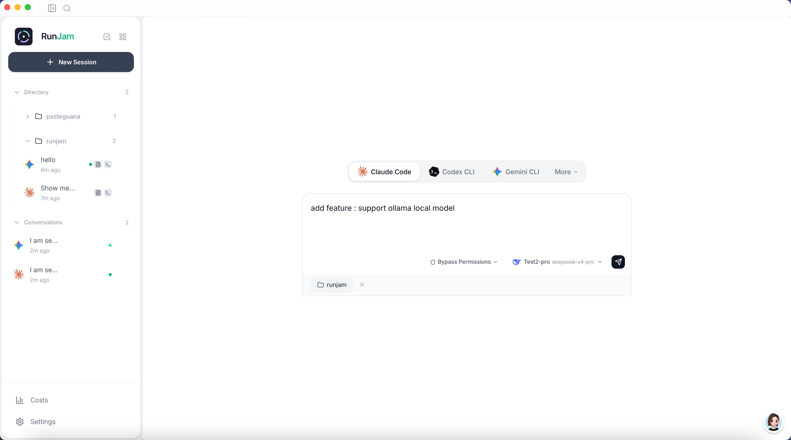
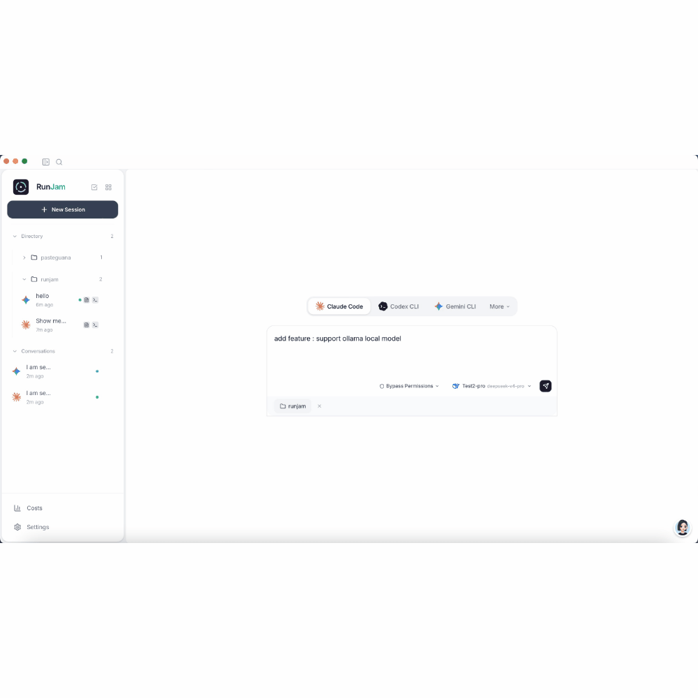

<div align="center">


# RunJam

### 一个桌面，管理你所有的 AI 编程助手

在一个统一的桌面应用中运行多个 AI 编程助手 — Claude Code、Codex CLI、Gemini CLI。自动检测、一键安装、实时流式、本地优先。

[](https://opensource.org/licenses/MIT)
[](https://tauri.app)
[](https://vuejs.org)
[](https://www.rust-lang.org)
[](CONTRIBUTING.md)

[功能特性](#-功能特性) · [快速开始](#-快速开始) · [架构](#-架构) · [路线图](#-路线图) · [常见问题](#-常见问题)

<br/>



</div>

---

## RunJam 是什么？

RunJam 是一个**本地优先、跨平台的 AI 编程助手桌面管理器**。可以把它理解为**AI Agent 的 Docker Desktop** — 像 Docker Desktop 管理容器一样管理你的 AI 编程 CLI 工具。

不必再在多个终端窗口之间切换、手动配置每个 Agent、搞不清哪个 Agent 在哪个项目上工作，RunJam 把所有东西整合到一个干净的界面里：

- **自动检测**系统中已安装的 AI Agent
- **一键安装**缺失的 Agent（Claude Code、Codex CLI、Gemini CLI）
- **统一聊天界面**，支持实时流式输出、Markdown 渲染和代码高亮
- **多项目、多 Agent** 并行会话
- **内置文件浏览器、终端和代码编辑器**
- **统一模型配置** — 配置一次，同步到所有 Agent
- **缓存优化** — 自动检测 prompt cache 命中，节省 token 和费用
- **本地模型** — 内置 llama.cpp 支持，免费离线使用开源模型
- **本地优先** — 所有数据留在你的机器上，不上云，不收集数据

> **核心理念：** RunJam 不要求 Agent 实现任何协议（如 ACP）。它直接通过 stdin/stdout 管道管理 Agent CLI 进程。**零修改，即装即用。**

---

## 功能特性



### Agent 管理
- **自动检测** — 扫描 PATH 中已安装的 AI Agent（Claude Code、Codex CLI、Gemini CLI）
- **一键安装/卸载** — 通过 `npm install -g` 安装 Agent，实时显示进度
- **Agent 配置** — 查看和编辑 Agent 配置文件（`~/.claude/`、`~/.codex/`、`~/.gemini/`）
- **按会话启用/禁用** Agent

### 统一聊天界面
- **实时流式输出** — 实时观看 Agent 的思考过程、工具调用和回复
- **Markdown 渲染** — 完整的 Markdown 支持，含语法高亮和 Mermaid 图表
- **思考过程展示** — Agent 推理步骤独立显示，可自动折叠
- **工具调用详情** — 展开查看工具输入输出
- **多 Agent 切换** — 像换聊天对象一样自然地切换 Agent

### 项目工作区
- **文件浏览器** — VS Code 风格的树形文件浏览
- **内置代码编辑器** — Monaco 编辑器，支持语法高亮
- **集成终端** — 每个项目内置 xterm.js 终端
- **最近项目** — 快速访问最近使用的项目目录

### 模型管理
- **统一模型中心** — 配置一次，自动同步到所有 Agent
- **服务商预设** — OpenAI、Anthropic、Google AI、Groq、DeepSeek、自定义 API 和本地模型
- **按 Agent 分配模型** — 为不同 Agent 分配不同的模型
- **模型别名** — 将友好名称映射到模型 ID
- **API 代理** — 内置本地代理，统一管理 API 密钥
- **缓存优化** — 自动检测 prompt cache 命中 + 本地响应缓存，节省 token 降低成本
- **本地模型** — 内置 llama.cpp 集成，100% 本地免费运行开源模型（DeepSeek Coder、Qwen、Llama 等）

### 会话管理
- **多会话并行** — 同时运行多个 Agent 会话
- **会话持久化** — 应用重启后会话不丢失
- **全文搜索** — 跨所有对话历史搜索
- **归档** — 归档旧会话，保持侧边栏整洁
- **用量统计** — 每个会话的 token 用量和费用估算

### 本地优先 & 安全
- **数据全在本地** — 对话、配置和 Agent 状态存储在 `~/.runjam/`
- **零遥测** — 无数据收集，无分析，无回传
- **无云依赖** — 完全可离线工作（Agent 需要各自的 API 访问）
- **系统钥匙串** — API 密钥安全存储在操作系统钥匙串中
- **本地模型** — 通过 llama.cpp 运行模型，零 API 费用

---

## 支持的 Agent

| Agent | CLI 命令 | 安装方式 | 服务商 |
|-------|---------|---------|--------|
| **Claude Code** | `claude` | `npm install -g @anthropic-ai/claude-code` | Anthropic |
| **Codex CLI** | `codex` | `npm install -g @openai/codex` | OpenAI |
| **Gemini CLI** | `gemini` | `npm install -g @google/gemini-cli` | Google |

> 更多 Agent 即将支持。RunJam 的架构使得添加新 Agent 非常容易 — 只需添加其检测和调用逻辑。

---

## 快速开始

### 环境要求

- **Node.js** ≥ 18（AI Agent CLI 需要）
- **Rust** ≥ 1.80（用于源码编译）
- **系统依赖**：
  - **macOS**：Xcode Command Line Tools
  - **Windows**：Microsoft Visual Studio C++ Build Tools + WebView2
  - **Linux**：`webkit2gtk` 及相关包

### 方式 A：下载预编译安装包

> 预编译安装包将在 [GitHub Releases](https://github.com/peintune/runjam/releases) 页面提供。

### 方式 B：从源码编译

```bash
# 克隆仓库
git clone https://github.com/peintune/runjam.git
cd runjam

# 安装前端依赖
npm install

# 开发模式运行（热更新）
npm run tauri dev

# 编译当前平台安装包（macOS → .dmg、Windows → .msi/.exe、Linux → .deb/.AppImage）
npm run tauri build
```

编译产物在 `src-tauri/target/release/bundle/` 目录下。

#### 分平台编译

```bash
# macOS：编译通用二进制（Intel + Apple Silicon）
npm run tauri build -- --target universal-apple-darwin

# macOS：仅 Intel
npm run tauri build -- --target x86_64-apple-darwin

# macOS：仅 Apple Silicon
npm run tauri build -- --target aarch64-apple-darwin

# Windows：编译 .msi / .exe（在 Windows 上运行，或从 macOS/Linux 交叉编译）
npm run tauri build -- --target x86_64-pc-windows-msvc

# Linux：编译 .deb / .AppImage
npm run tauri build -- --target x86_64-unknown-linux-gnu
```

> **交叉编译说明：** 从 macOS/Linux 编译 Windows 安装包需要额外的 Rust 工具链。
> 建议在各平台的原生环境中编译（如使用 CI runner）。

### 首次运行

1. 打开 RunJam — 自动检测已安装的 AI Agent
2. 前往 **设置 → Agent**，一键安装缺失的 Agent
3. 前往 **设置 → 模型**，配置 API 密钥和模型
4. 点击 **新建会话**，选择 Agent，可选选择项目文件夹
5. 开始对话！

---

## 架构

```
┌─────────────────────────────────────────────────────┐
│                  RunJam (Tauri 2)                     │
│                                                       │
│  ┌──────────┐    ┌──────────┐    ┌──────────┐       │
│  │ 会话 1   │    │ 会话 2   │    │ 会话 3   │       │
│  │ (Claude) │    │ (Codex)  │    │ (Gemini) │       │
│  └────┬─────┘    └────┬─────┘    └────┬─────┘       │
│       │               │               │               │
│  stdin/stdout     stdin/stdout    stdin/stdout       │
│       │               │               │               │
│  ┌────▼───────────────▼───────────────▼─────┐       │
│  │         Vue 3 前端（聊天 UI）               │       │
│  └──────────────────────────────────────────┘       │
└─────────────────────────────────────────────────────┘
```

### 技术栈

| 层级 | 技术 | 理由 |
|------|------|------|
| **桌面框架** | Tauri 2 | 比 Electron 小 90%，原生性能 |
| **后端** | Rust | 零 GC 停顿，优秀的进程管理 |
| **前端** | Vue 3 + TypeScript | 响应式，生态成熟 |
| **样式** | Tailwind CSS v4 | 快速 UI 开发 |
| **状态管理** | Pinia | Vue 3 官方，出色的 TS 支持 |
| **数据库** | SQLite (rusqlite) | 本地优先，零配置 |
| **代码编辑器** | Monaco Editor | VS Code 的编辑器引擎 |
| **终端** | xterm.js | 行业标准 Web 终端 |
| **进程通信** | stdin/stdout 管道 | Agent 无需任何修改 |

### 项目结构

```
runjam/
├── src-tauri/                  # Rust 后端
│   └── src/
│       ├── commands/           # Tauri 命令处理（IPC 桥接）
│       ├── agent/              # Agent 检测与安装
│       ├── session/            # 会话管理与进程控制
│       ├── models/             # 数据结构
│       ├── db/                 # SQLite 层与迁移
│       ├── proxy.rs            # 本地 API 代理
│       └── ...
├── src/                        # Vue 3 前端
│   ├── components/             # UI 组件
│   ├── views/                  # 页面视图
│   ├── stores/                 # Pinia 状态管理
│   ├── api/                    # Tauri invoke 封装
│   ├── composables/            # Vue 组合式函数
│   └── i18n/                   # 国际化（EN/ZH）
├── landing.html                # 落地页（独立构建）
└── package.json
```

---

## 工作原理

RunJam 将 AI Agent CLI 工具作为子进程管理：

1. **检测** — 在 `PATH` 中扫描 `claude`、`codex`、`gemini` 可执行文件
2. **调用** — 将 Agent CLI 作为子进程启动，管道接入 `stdin`
3. **流式输出** — 逐行读取 `stdout`，通过 Tauri 事件流式推送到前端
4. **解析** — 解析 Agent 输出（思考步骤、工具调用、最终回复）
5. **渲染** — Vue 前端渲染 Markdown、代码块和 Mermaid 图表

**不依赖网络协议。不修改 Agent。不使用 ACP。** 纯原生 CLI 进程。

---

## 路线图

- [x] Agent 自动检测与一键安装
- [x] 统一流式聊天界面
- [x] 多 Agent、多项目会话
- [x] 内置文件浏览器、编辑器、终端
- [x] 统一模型配置与同步
- [x] 会话持久化与搜索
- [x] 本地 API 代理统一密钥管理
- [x] 国际化（English / 中文）
- [x] Prompt cache 优化（自动检测缓存命中、响应缓存）
- [x] llama.cpp 本地模型支持（下载、运行、管理 GGUF 模型）
- [ ] PTY 会话模式（持久化多轮上下文）
- [ ] 用量统计仪表板（带图表）
- [ ] Git worktree 集成
- [ ] Agent 自动更新检测
- [ ] 插件/技能系统
- [ ] Linux 构建

---

## 常见问题

### RunJam 和 Cursor / GitHub Copilot 有什么区别？

Cursor 和 Copilot 是 AI 驱动的代码编辑器。RunJam **不是** AI 也不是编辑器 — 它是一个**管理器**，让你现有的 AI CLI Agent 更加高效。可以理解成 Claude Code、Codex CLI、Gemini CLI 的统一操作面板。

### RunJam 和 AionUI 有什么区别？

AionUI 要求 Agent 实现 ACP（Agent Client Protocol）。RunJam 采用不同的方式：通过 stdin/stdout 以原生 CLI 进程的方式管理 Agent。**Agent 无需任何修改。** 这意味着 RunJam 开箱即支持任何 CLI Agent。

### 我的数据会被上传到云端吗？

**不会。** RunJam 是本地优先的。所有 Agent 进程都在你的机器上运行。所有数据（对话、配置、Agent 状态）都本地存储在 `~/.runjam/`。无遥测、无分析、无云同步。

### RunJam 是免费的吗？

**是的。** RunJam 完全开源，使用 MIT 许可证。免费使用、修改和分发。

### 可以同时运行多个 Agent 吗？

**可以。** 你可以为不同项目创建独立的会话，每个使用不同的 Agent。它们独立并行运行，互不干扰。

### 系统要求是什么？

支持 macOS、Windows 和 Linux。唯一的前提是 **Node.js ≥ 18**（AI Agent CLI 需要）。RunJam 会检查并在需要时引导你安装。

---

## 参与贡献

欢迎贡献！查看 [CONTRIBUTING.md](CONTRIBUTING.md) 了解环境搭建、代码规范和 PR 流程。

### 我们需要的帮助

- Linux 构建测试与打包
- 新 Agent 支持（Aider、Continue 等）
- UI/UX 改进
- 文档与翻译
- Bug 报告与测试

---

## 许可证

[MIT](LICENSE) © RunJam Contributors

---

<div align="center">

**[⭐ Star 这个仓库](https://github.com/peintune/runjam)** 如果你觉得有用！

由 Rust 🦀 和 Vue 3 💚 打造

</div>
