<div align="center">


# RunJam

### 一个桌面，所有 AI Agent，零锁定。

**本地优先** 的桌面管理器，统一管理 **Claude Code、Codex CLI、Gemini CLI**。一次配置，所有 Agent 都能用任意模型；多项目并行，一个窗口搞定。无需 ACP 改造，无需逐个改配置，不上云、不绑死。

[](https://opensource.org/licenses/MIT)
[](https://tauri.app)
[](https://vuejs.org)
[](https://www.rust-lang.org)
[](CONTRIBUTING.md)
[](https://www.runjam.app/)

[功能特性](#-为什么选-runjam) · [快速开始](#-快速开始) · [架构](#-架构) · [路线图](#-路线图) · [常见问题](#-常见问题)

[🌐 访问官网](https://www.runjam.app/) · [English](README.md)

<br/>

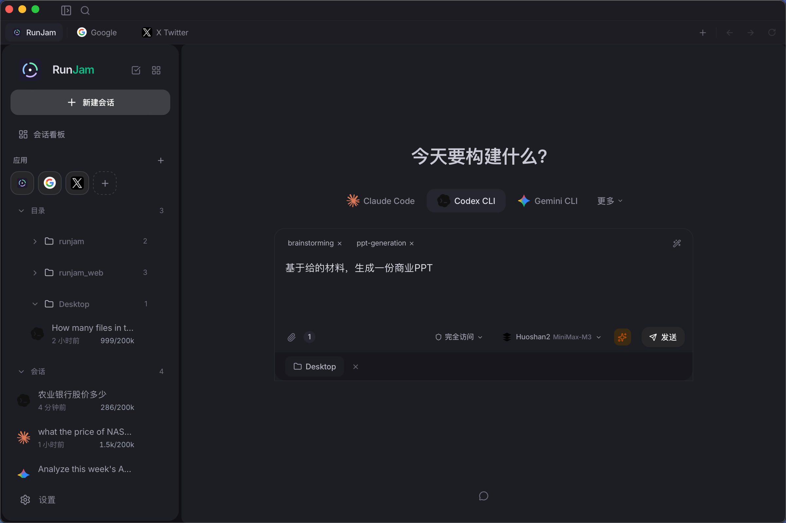
<br/>
<br/>

</div>

## 🏗️ 架构

> 一张图看懂 RunJam：**多 Agent → RunJam（协议自动转换）→ 多模型（商业 + 本地）**。

<p align="center">
  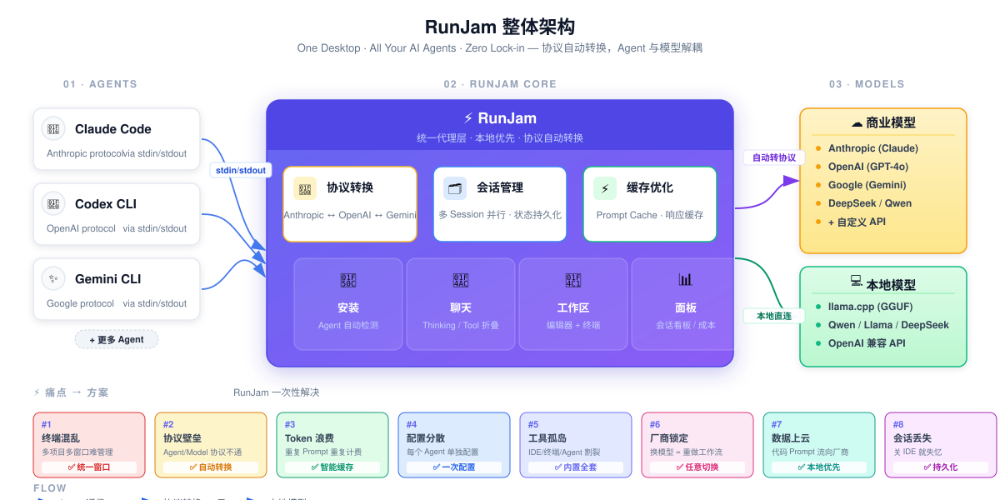
  <br/>
  <sub>🇺🇸 <a href="docs/screenshots/en/00-architecture.svg">English version</a></sub>
</p>

**阅读顺序（从左到右）：**

- **01 · AGENTS** — 任意 Agent CLI（Claude Code / Codex CLI / Gemini CLI / …）通过 `stdin/stdout` 接入 — **Agent 零改造**
- **02 · RUNJAM CORE** — 三大核心：🔀 **协议转换**（Anthropic ↔ OpenAI ↔ Gemini）、🗂️ **会话管理**（多 Session 并行、状态持久化）、⚡ **缓存优化**（Prompt Cache + 响应缓存）；下方四个能力：🔌 安装 / 💬 聊天 / 📁 工作区 / 📊 面板
- **03 · MODELS** — 接入任意模型：☁️ 云端（Anthropic、OpenAI、Google、DeepSeek、Qwen、自定义 API）和 💻 本地（llama.cpp + GGUF，OpenAI 兼容 API）
- **底部 · 痛点 → 方案** — 终端混乱、协议孤岛、Token 浪费、配置分散、工具孤岛、厂商锁定、云端泄露、会话丢失 —— 每个痛点都对应内置解法

---

## 30 秒看懂 RunJam

- 🪟 **一个窗口，所有项目。** 聊天、文件树、Monaco 编辑器、终端，全部集成在一个 App 里，多个会话并行。
- 🔌 **任意 Agent，任意模型。** 内置协议代理，Anthropic ↔ OpenAI ↔ Gemini 实时互转。Claude Code 跑 GPT、Codex 跑 Claude 都行。配置一次，全 Agent 同步。
- 🛠️ **Agent 零改造。** 不像 ACP 系方案，RunJam 直接通过原生 CLI 的 stdin/stdout 驱动 Agent。今天就能用，任意 Agent 都能接。
- 💸 **把 API 账单砍下来。** 自动检测 prompt cache、本地响应缓存、一键启动本地模型（llama.cpp）。
- 🔒 **本地优先，隐私安全。** 对话、配置、API Key 全在你机器上。零遥测，零云同步。

---

## 😩 痛点 —— 为什么需要 RunJam

如果你天天用 AI 编程 Agent，下面这些至少中过一条：

> **1. 终端动物园。** 五个终端标签页，每个跑不同 Agent、各自改不同项目。分不清哪个是哪个，kill 错一个，会话全没了。

> **2. 模型不互通。** 想用同一个 prompt 同时测 Claude Sonnet、GPT-4o、本地 Qwen？得分别在 `~/.claude/`、`~/.codex/`、`~/.gemini/` 里改三遍配置。

> **3. 协议高墙。** Claude Code 只讲 Anthropic，Codex 只讲 OpenAI，Gemini CLI 只讲 Google。模型和 Agent 死死绑在一起，想换个模型得钻进 Agent 内部改。

> **4. Token 烧钱。** 每个轮次都重发同一份 system prompt，自己到底烧了多少、哪些命中了缓存、哪些没命中 —— 一无所知。

> **5. 配环境配到崩溃。** 新项目、新 Agent、新 API Key、新配置文件、新 PATH 问题、新 npm install、新版本冲突。每次都来一遍。

> **6. 单一 Agent 锁定。** Cursor 包了 GPT-4，Copilot 包了 OpenAI。模型换了、价格涨了，你整个工作流都得迁移。

> **7. 云端数据焦虑。** 某些"AI IDE"把你的代码发到厂商服务器。你的私有代码、内部配置、Prompt —— 全不在自己掌控中。

> **8. 会话黑洞。** 关掉 IDE 会话就丢，换台机器从头来，想找上周某条 Prompt？祝你好运。

---

## ✅ RunJam 怎么解决

| 痛点 | RunJam 的解法 |
|------|-----------------|
| 终端动物园 | **统一窗口**，并行会话、侧边栏、每个会话独立工作区 |
| 模型不互通 | **统一模型中心** —— 配一次，每个 Agent 两次点击就能绑定 |
| 协议高墙 | **内置协议代理**，Anthropic / OpenAI / Gemini 实时互转 |
| Token 烧钱 | **自动检测 prompt cache** + 本地响应缓存 + 每会话费用看板 |
| 配环境崩溃 | **自动检测 + 一键安装** Claude Code / Codex CLI / Gemini CLI |
| 单一 Agent 锁定 | **Agent 中立** —— 换 Agent 不换工作流 |
| 云端数据焦虑 | **本地优先**，数据全在 `~/.runjam/`，API Key 进系统钥匙串，零遥测 |
| 会话黑洞 | **会话持久化**、全文搜索、归档、跨设备同步友好 |

---

## 🆚 RunJam 对比一览

| | **RunJam** | Cursor / Copilot | AionUI | 原生 CLI |
|---|:---:|:---:|:---:|:---:|
| 本地优先，不上云 | ✅ | ❌ | ✅ | ✅ |
| 兼容任意 AI Agent CLI | ✅ | ❌ | ⚠️ 仅 ACP | ✅ |
| 模型协议自动转换 | ✅ | ❌ | ⚠️ | ❌ |
| Agent 一键安装 | ✅ | ❌ | ❌ | ❌ |
| 多项目并行 | ✅ | ❌ | ⚠️ | ❌ |
| 内置编辑器 + 终端 + 文件树 | ✅ | ✅ | ⚠️ | ❌ |
| 本地模型 (llama.cpp) | ✅ | ❌ | ❌ | ❌ |
| 应用管理（自配网页应用） | ✅ | ❌ | ❌ | ❌ |
| 会话看板 | ✅ | ❌ | ❌ | ❌ |
| 费用统计看板 | ✅ | ❌ | ❌ | ❌ |
| 开源 (MIT) | ✅ | ❌ | ✅ | ✅ |
| Agent 无需改造 | ✅ | n/a | ❌ | n/a |

---

## ✨ 功能详解

### 🛠️ Agent 管理

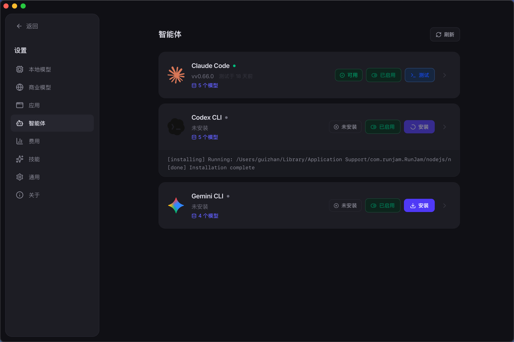

- **自动检测** —— 扫描 `PATH` 找 `claude`、`codex`、`gemini`，一眼看清装没装
- **一键安装/卸载** —— `npm install -g` 实时显示进度
- **Agent 配置查看** —— 在 GUI 里直接编辑 `~/.claude/`、`~/.codex/`、`~/.gemini/`
- **按会话启用/禁用** —— 每个项目用哪些 Agent，由你决定

### 💬 统一聊天界面

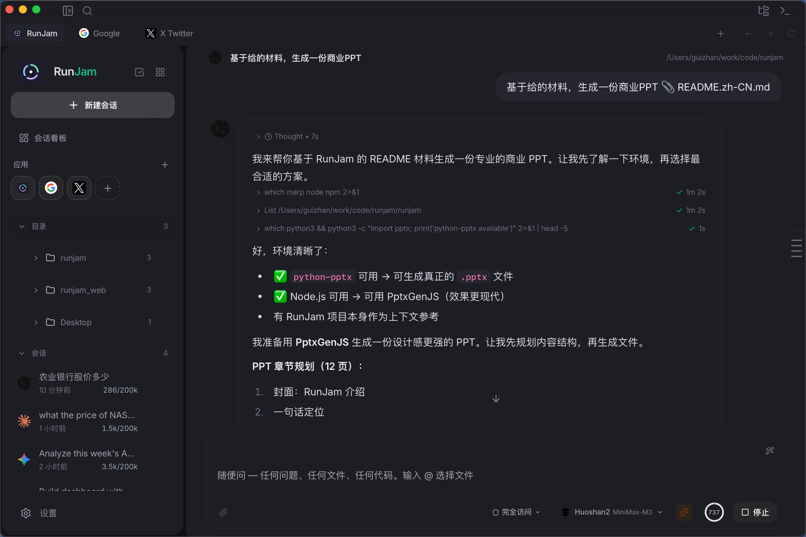

<br/>
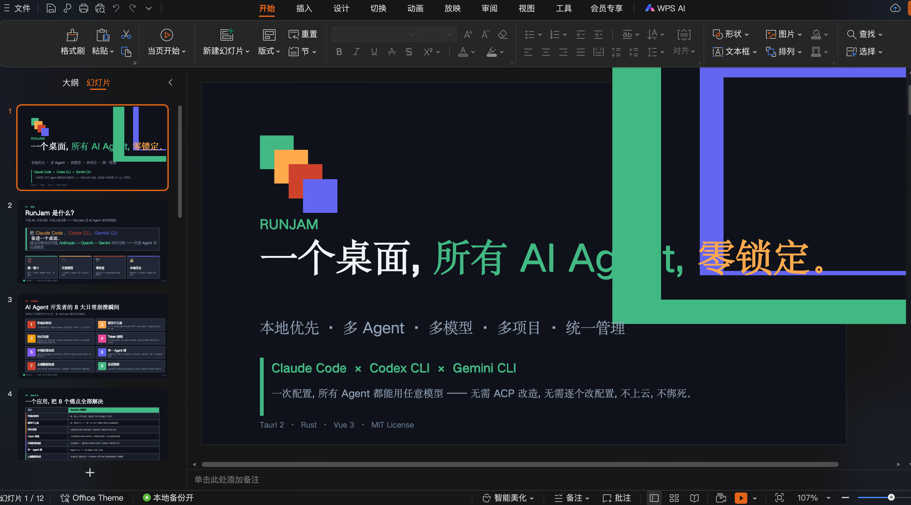

- **实时流式输出** —— 思考步骤、工具调用、最终答案，实时呈现
- **Markdown + 代码高亮 + Mermaid 图表** —— 内联干净渲染
- **可折叠的思考块** —— Agent 推理过程和最终答案分开
- **可展开的工具调用详情** —— 不离开聊天页就能查看输入输出
- **多 Agent 切换** —— 切换 Claude Code / Codex / Gemini 像换聊天对象一样自然

### 📁 项目工作区


- **VS Code 风格文件浏览器** —— 项目树形视图
- **Monaco 代码编辑器** —— 和 VS Code 同款引擎，完整语法高亮
- **集成 xterm.js 终端** —— 每个项目一个终端，持久化
- **最近项目** —— 常用目录一键直达

### 🧠 统一模型中心

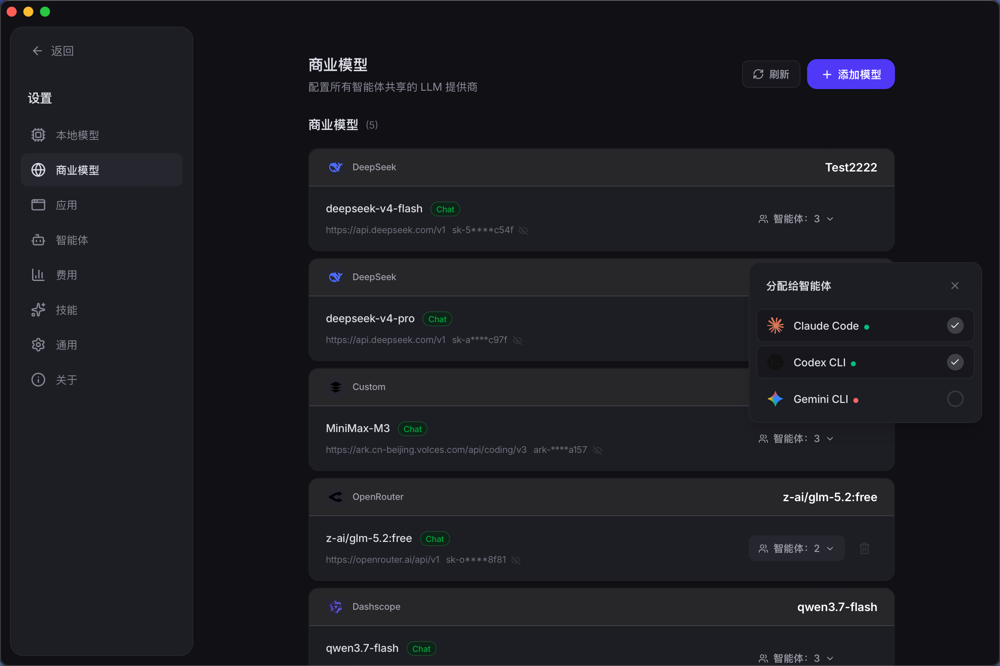

- **配置一次，全 Agent 同步**
- **服务商预设** —— Anthropic、OpenAI、Google AI、Groq、DeepSeek、Qwen、自定义 API
- **按 Agent 分配模型** —— Claude Code 用一个模型，Codex 用另一个，随你定
- **模型别名** —— 把 `fast`、`smart` 这种友好名映射到真实模型 ID
- **本地 API 代理** —— 统一管 API Key，协议自动转换

### 💻 本地模型启动 *(新)*


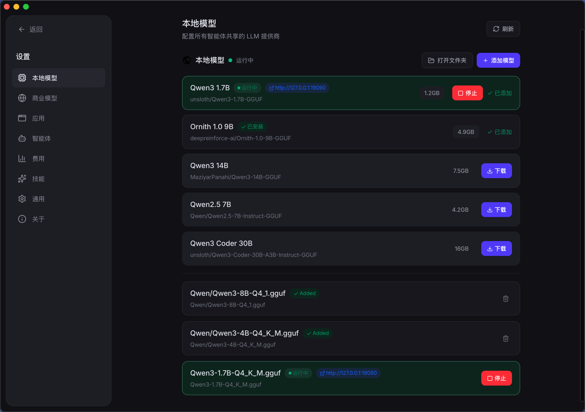

<br/>
<br/>

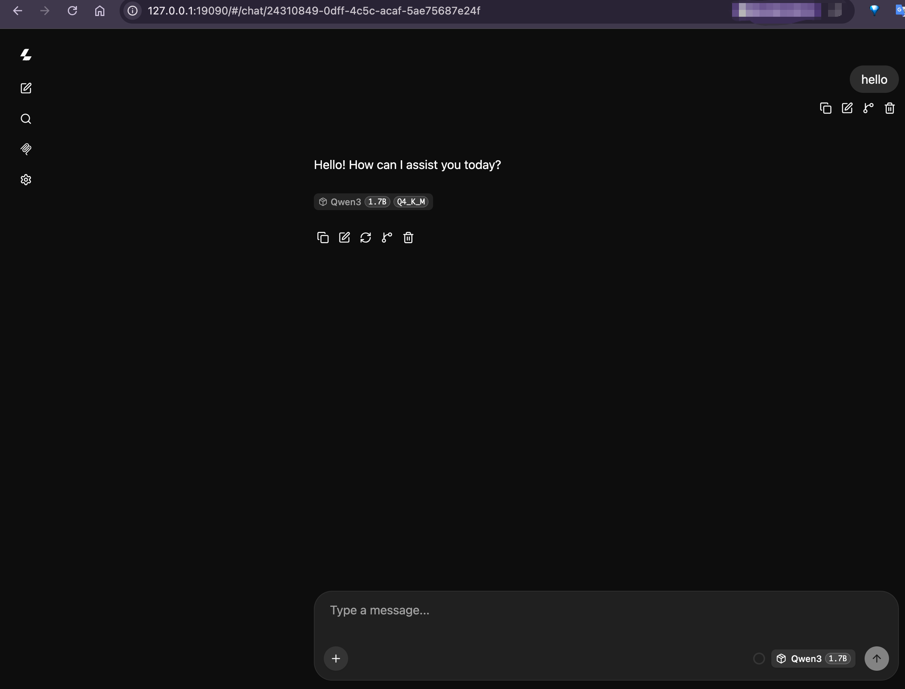

<br/>
<br/>

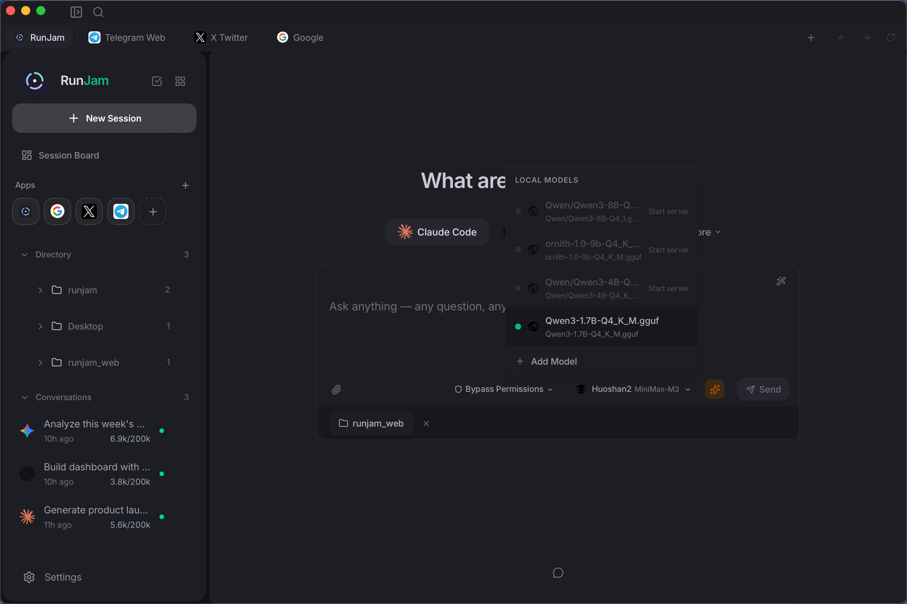

在本机跑开源大模型。**免费、离线、私密。**

- **内置 llama.cpp 服务管理** —— 启动、停止、监控本地推理进程
- **界面化下载 GGUF 模型** —— DeepSeek Coder、Qwen、Llama、Mistral 等
- **一键启动** —— 选模型 → 点启动，RunJam 自动接入和云端同一个代理
- **零 API 费用** —— 没有速率限制、没有 token 计费、数据不出本机
- **OpenAI 兼容 API** —— 本地模型讲同一套协议，所有 Agent 无缝使用

> **为什么重要：** 你的私有代码、Prompt 永远不会发到厂商服务器。常规任务用本机 7B 模型跑，难题再走付费 API —— 两全其美。

### 🧩 应用管理 *(新)*

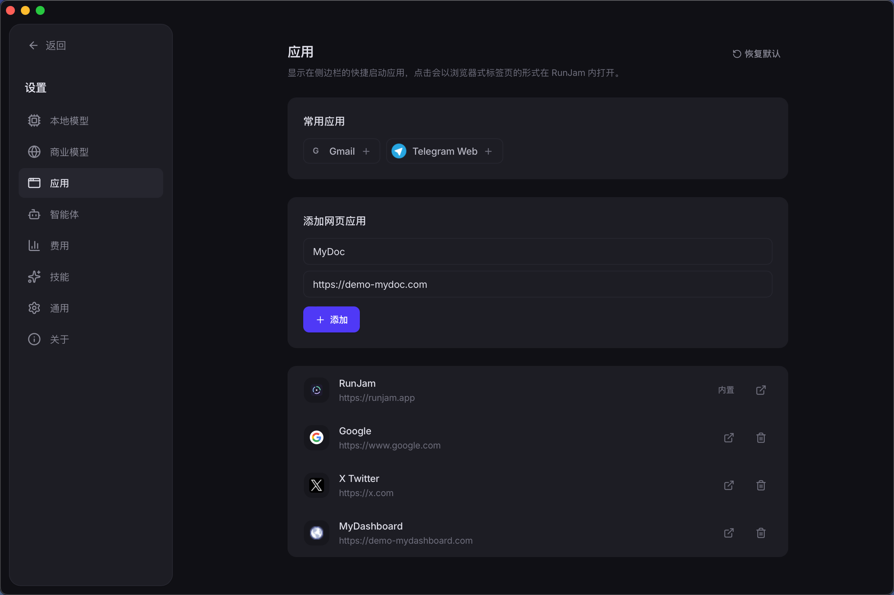

把你常用的网页应用钉到 RunJam 里。**一个启动器，万事可达。**

- **注册任意网页应用** —— 内部看板、文档站、Grafana、Sentry、公司 Wiki
- **自定义名称、URL、图标** —— 让它看起来像 RunJam 的原生模块
- **一键打开** —— 不用再翻浏览器书签
- **配合 Agent 用更香** —— 把日志看板和 Agent 会话放一起，Agent 可以通过 MCP / 浏览器工具直接读

### 📊 会话看板 *(新)*

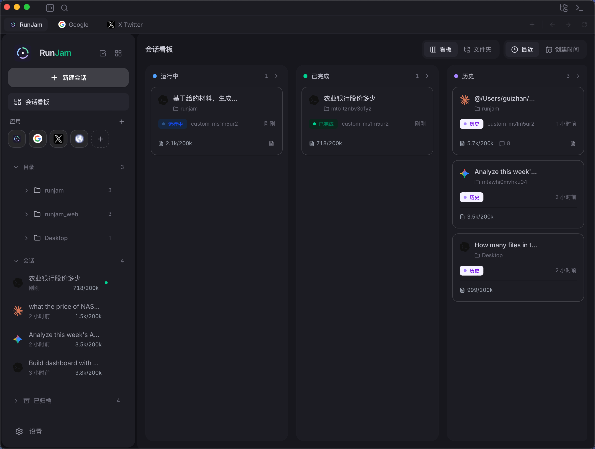

所有会话一眼可见。**再也不用来回猜"哪个 Agent 在干啥"。**

- **看板 / 列表视图** —— 会话作为卡片分列：空闲 / 运行中 / 等待输入 / 异常
- **每会话实时状态** —— 是在工作、等你输入，还是卡住了？
- **项目 + Agent 徽标** —— 一眼看清每个会话的上下文
- **最后活动时间** —— 知道哪些会话需要你关注
- **拖拽重排** —— 你的工作流，你的布局
- **点击直达** —— 从卡片直接打开会话

> **为什么重要：** 同时跑五个 Agent、改五个仓库时，"东西都在哪"是最难的问题。看板让答案显而易见。

### 💰 费用统计

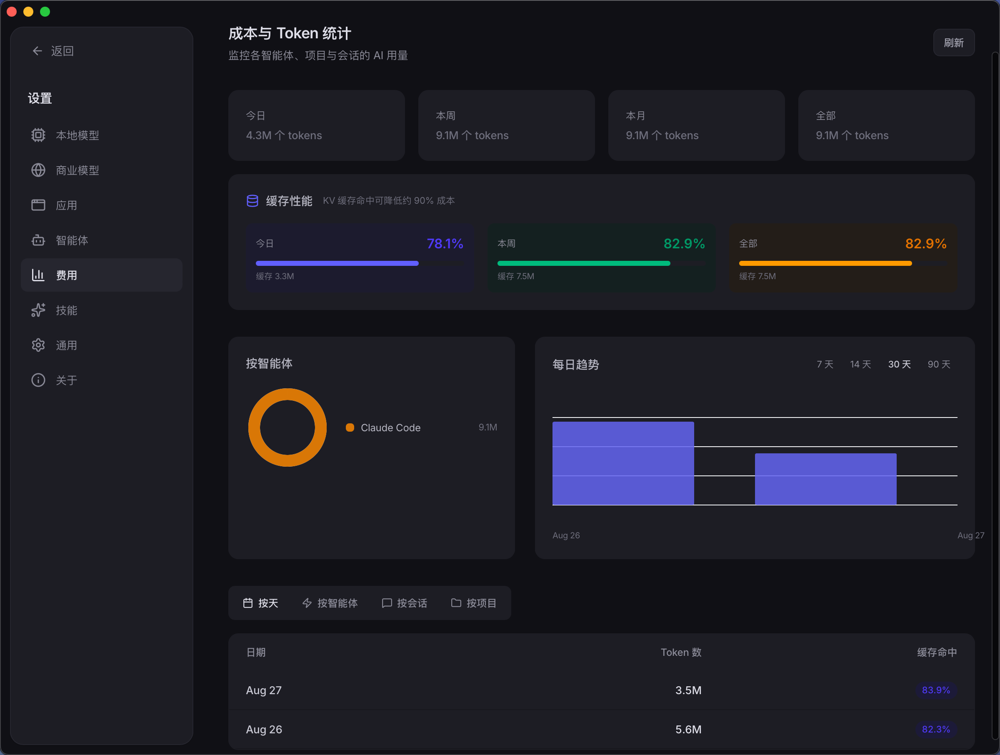

- **每会话 Token 用量** —— 钱花哪儿了，心里有数
- **费用估算** —— 按模型、按 Agent、按天
- **图表看板** —— 一眼看清趋势
- **缓存命中率** —— 看 prompt cache 帮你省了多少

### 🔀 协议代理（核心杀手锏）


大多数管理器只是把 Agent 的请求转给厂商 API。RunJam 做了更多：

- **Anthropic ↔ OpenAI ↔ Gemini 自动翻译** —— 任意 Agent 用任意模型
- **响应缓存** —— 重复请求本地回答，不花 token
- **Prompt cache 检测** —— 上游 API 已经缓存的 prompt，不会再让你付一次钱
- **API Key 统一入口** —— 密钥进系统钥匙串，对 Agent 透明

> **这才是"配置一次、全 Agent 同步"的真正实现。** 没有这个代理，每个 Agent 每个模型都得单独配。有了它，一份模型定义驱动所有 Agent。

### 🔒 本地优先 & 安全

- **数据全在本地** —— 对话、配置、Agent 状态都在 `~/.runjam/`
- **零遥测、零分析、零回传**
- **无云依赖** —— 完全可离线（Agent 自己要 API 时除外）
- **系统钥匙串** —— API Key 不会落到明文配置文件里
- **本地模型** —— 通过 llama.cpp 跑模型，零 API 费用

### 💼 会话管理

- **多会话并行** —— 你的机器扛得住几个就跑几个
- **会话持久化** —— 应用重启、甚至崩溃后会话都不丢
- **全文搜索** —— 任何过去的 prompt、回复、工具调用都能搜到
- **归档** —— 旧会话从侧边栏收起来，但不丢失
- **费用统计** —— 内置，按会话统计

---

## 🧩 RunJam 的一天

**场景 1 —— 周一早上，三个仓库要动**

打开 RunJam。会话看板显示三张卡：`runjam-core`（Claude Code，运行中）、`api-refactor`（Codex，空闲，等你输入）、`experiments`（Gemini，等待审阅）。点开 Codex 那张卡，丢个新 Prompt，继续干别的。三个项目一个窗口，告别切终端。

**场景 2 —— 周中，账单审计**

打开费用看板。图表显示本周 60% 的 token 烧在了 `api-refactor` 会话上，几乎全是 GPT-4o。打开模型中心，把那个会话换成本地 Qwen-Coder 跑常规重构，难的任务才留给 GPT-4o。下周同一张图，费用砍半。

**场景 3 —— 周五，敏感任务**

客户发来一段含他们专有定价模型的合同条款。不想让任何东西碰到厂商 API。打开本地模型启动器，点"启动"已经下好的 Qwen-72B，全程在本机跑分析。数据从来没出过你的笔记本。

---

## 🤖 支持的 Agent

| Agent | CLI 命令 | 安装方式 | 服务商 |
|-------|---------|---------|--------|
| **Claude Code** | `claude` | `npm install -g @anthropic-ai/claude-code` | Anthropic |
| **Codex CLI** | `codex` | `npm install -g @openai/codex` | OpenAI |
| **Gemini CLI** | `gemini` | `npm install -g @google/gemini-cli` | Google |

> 更多 Agent 即将支持。RunJam 的 Agent 层是可插拔的 —— 加新 Agent 只需加检测和调用逻辑，不用改协议。

---

## 🚀 快速开始

### 环境要求

- **Node.js** ≥ 18（AI Agent CLI 需要）
- **Rust** ≥ 1.80（用于源码编译）
- **系统依赖**：
  - **macOS**：Xcode Command Line Tools
  - **Windows**：Microsoft Visual Studio C++ Build Tools + WebView2
  - **Linux**：`webkit2gtk` 及相关包

### 方式 A —— 下载预编译安装包

> 预编译安装包将在 [GitHub Releases](https://github.com/peintune/runjam/releases) 页面提供。

### 方式 B —— 从源码编译

```bash
# 克隆仓库
git clone https://github.com/peintune/runjam.git
cd runjam

# 安装前端依赖
npm install

# 开发模式运行（热更新）
npm run tauri dev

# 编译当前平台安装包（macOS → .dmg、Windows → .msi/.exe、Linux → .deb/.AppImage）
npm run tauri build
```

编译产物在 `src-tauri/target/release/bundle/` 目录下。

#### 分平台编译

```bash
# macOS：编译通用二进制（Intel + Apple Silicon）
npm run tauri build -- --target universal-apple-darwin

# macOS：仅 Intel
npm run tauri build -- --target x86_64-apple-darwin

# macOS：仅 Apple Silicon
npm run tauri build -- --target aarch64-apple-darwin

# Windows：编译 .msi / .exe（在 Windows 上运行，或从 macOS/Linux 交叉编译）
npm run tauri build -- --target x86_64-pc-windows-msvc

# Linux：编译 .deb / .AppImage
npm run tauri build -- --target x86_64-unknown-linux-gnu
```

> **交叉编译说明：** 从 macOS/Linux 编译 Windows 安装包需要额外的 Rust 工具链。建议在各平台的原生环境中编译（如使用 CI runner）。

### 首次运行

1. 打开 RunJam —— 自动检测已安装的 AI Agent
2. 前往 **设置 → Agent**，一键安装缺失的 Agent
3. 前往 **设置 → 模型**，配置 API 密钥和模型
4. *（可选）* 前往 **本地模型**，下载并启动一个 GGUF 模型
5. *（可选）* 前往 **应用管理**，钉住你常用的网页应用
6. 点击 **新建会话**，选择 Agent，可选选择项目文件夹
7. 开始对话！

---


### 技术栈

| 层级 | 技术 | 理由 |
|------|------|------|
| **桌面框架** | Tauri 2 | 比 Electron 小 90%，原生性能 |
| **后端** | Rust | 零 GC 停顿，优秀的进程管理 |
| **前端** | Vue 3 + TypeScript | 响应式，生态成熟 |
| **样式** | Tailwind CSS v4 | 快速 UI 开发 |
| **状态管理** | Pinia | Vue 3 官方，出色的 TS 支持 |
| **数据库** | SQLite (rusqlite) | 本地优先，零配置 |
| **代码编辑器** | Monaco Editor | VS Code 的编辑器引擎 |
| **终端** | xterm.js | 行业标准 Web 终端 |
| **本地推理** | llama.cpp | 业界标杆的 CPU/GPU 本地大模型运行时 |
| **进程通信** | stdin/stdout 管道 | Agent 无需任何修改 |

### 项目结构

```
runjam/
├── src-tauri/                  # Rust 后端
│   └── src/
│       ├── commands/           # Tauri 命令处理（IPC 桥接）
│       ├── agent/              # Agent 检测与安装
│       ├── session/            # 会话管理与进程控制
│       ├── dashboard/          # 会话看板状态
│       ├── apps/               # 应用管理
│       ├── local_model/        # llama.cpp / GGUF 管理
│       ├── models/             # 数据结构
│       ├── db/                 # SQLite 层与迁移
│       ├── proxy.rs            # 本地 API 代理 + 协议适配
│       └── ...
├── src/                        # Vue 3 前端
│   ├── components/             # UI 组件
│   ├── views/                  # 页面视图（Chat、Dashboard、AppMgr…）
│   ├── stores/                 # Pinia 状态管理
│   ├── api/                    # Tauri invoke 封装
│   ├── composables/            # Vue 组合式函数
│   └── i18n/                   # 国际化（EN/ZH）
├── docs/
│   └── screenshots/            # README 截图（你来填充）
├── landing.html                # 落地页（独立构建）
└── package.json
```

---

## ⚙️ 工作原理

RunJam 把 AI Agent CLI 工具当作子进程来管理：

1. **检测** —— 在 `PATH` 中扫描 `claude`、`codex`、`gemini` 可执行文件
2. **调用** —— 把 Agent CLI 作为子进程启动，`stdin` 接入管道
3. **流式输出** —— 逐行读 `stdout`，通过 Tauri 事件流式推送到前端
4. **协议代理** —— RunJam 内置代理拦截 Agent 的 API 调用，自动在不同 LLM 协议之间转换（Anthropic ↔ OpenAI ↔ Gemini），让任何 Agent 都能用任何模型
5. **本地推理** —— 当模型指向本地 llama.cpp 服务时，代理通过 OpenAI 兼容 API 与之通信
6. **解析 & 渲染** —— 解析 Agent 输出（思考步骤、工具调用、最终回复）；Vue 渲染 Markdown、代码块和 Mermaid 图表

**不依赖网络协议。不修改 Agent。** 纯原生 CLI 进程 + 自动协议适配。

---

## 🗺️ 路线图

- [x] Agent 自动检测与一键安装
- [x] 统一流式聊天界面
- [x] 多 Agent、多项目会话
- [x] 内置文件浏览器、编辑器、终端
- [x] 统一模型配置与同步
- [x] 会话持久化与搜索
- [x] 本地 API 代理统一密钥管理
- [x] 国际化（English / 中文）
- [x] Prompt cache 优化（自动检测缓存命中、响应缓存）
- [x] llama.cpp 本地模型支持（下载、运行、管理 GGUF 模型）
- [x] PTY 会话模式（持久化多轮上下文）
- [x] 用量统计仪表板（带图表）
- [x] **应用管理 —— 把自配网页应用钉进 RunJam**
- [x] **会话看板 —— 一屏掌握所有会话状态**
- [x] **本地模型启动器 —— 一键启动本地模型服务**
- [ ] Git worktree 集成
- [ ] Agent 自动更新检测
- [x] 插件 / 技能系统
- [ ] Linux 构建
- [ ] 移动端伴侣（只读会话视图）

---

## ❓ 常见问题

### RunJam 和 Cursor / GitHub Copilot 有什么区别？

Cursor 和 Copilot 是 AI 驱动的代码编辑器，它们包了一个特定模型、把代码发到厂商云、把你锁在单一工作流里。RunJam **不是** AI 也不是编辑器 —— 它是一个**管理器**，让你现有的 AI CLI Agent（Claude Code、Codex CLI、Gemini CLI）更高效。Agent、模型、本地数据、灵活性，全都留给你。

### RunJam 和 AionUI 有什么区别？

AionUI 要求每个 Agent 都实现 ACP（Agent Client Protocol）。这需要每个 Agent 维护者真正投入，而且很多 Agent 根本不讲 ACP。RunJam 走另一条路：通过 stdin/stdout 直接驱动 Agent 的原生 CLI。**Agent 无需任何修改。** 这意味着 RunJam 今天就能用任何 CLI Agent，新 Agent 接入也是第一天就能用。

### Agent CLI 必须自己装吗？

不必。RunJam 自动检测 `PATH` 里的 Agent，并提供 **一键安装** Claude Code / Codex CLI / Gemini CLI（`npm install -g`），UI 实时显示进度。

### 我能让一个 Agent 用它原生不支持的模型吗？

可以。这正是协议代理的价值。例：Claude Code（Anthropic 协议）调用 GPT-4o（OpenAI 协议）。代理实时翻译。你不用动 Agent，也不用动模型。

### 我的数据会上云吗？

**不会。** RunJam 是本地优先的。所有 Agent 进程都在你机器上跑。所有数据（对话、配置、Agent 状态）都本地存在 `~/.runjam/`。无遥测、无分析、无云同步。API Key 进系统钥匙串，不进配置文件。

唯一碰到云的是 LLM API 调用本身 —— 而服务商是你选的。跑本地 llama.cpp 模型的话，全程数据都不出本机。

### RunJam 是免费的吗？

**是的。** RunJam 完全开源，MIT 协议。免费使用、修改、分发。本地模型永远免费（你出硬件）。云模型按服务商正常计费。

### 可以同时跑多个 Agent 吗？

**可以。** 你可以为不同项目创建独立会话，每个用不同 Agent。它们独立并行、互不干扰。会话看板给你所有会话的一屏概览。

### 系统要求是什么？

支持 macOS、Windows、Linux。唯一前提是 **Node.js ≥ 18**（AI Agent CLI 需要）。RunJam 会检测并在需要时引导你安装。

### macOS 提示"RunJam 已损坏，无法打开"？

这是 macOS Gatekeeper 拦截了未签名应用。终端执行下面命令移除隔离属性：

```bash
xattr -cr /Applications/RunJam.app
```

> 我们正在推进 Apple 代码签名和公证，未来会消除这一步。

### 我能加一个不在支持列表里的 Agent 吗？

可以。RunJam 的 Agent 层小而显式 —— 加新 Agent 只需要加检测 + 调用。详见 `CONTRIBUTING.md` 的 Agent 集成指南。欢迎 PR。

---

## 🤝 参与贡献

欢迎贡献！查看 [CONTRIBUTING.md](CONTRIBUTING.md) 了解环境搭建、代码规范和 PR 流程。

### 我们需要的帮助

- Linux 构建测试与打包
- 新 Agent 支持（Aider、Continue、Goose……）
- UI/UX 改进
- 文档与翻译
- Bug 报告与测试
- 本地模型基准测试与预设

---

## 📄 许可证

[MIT](LICENSE) © RunJam Contributors

---

<div align="center">

**[⭐ Star 这个仓库](https://github.com/peintune/runjam)** 如果你觉得有用！

由 Rust 🦀 和 Vue 3 💚 打造

</div>
